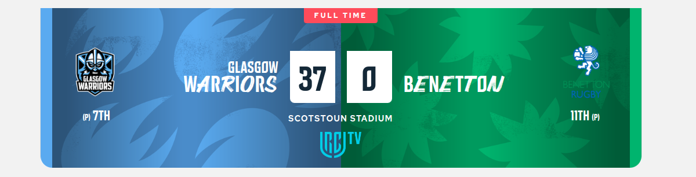

# Frontenders Community

## Challenge #2 - Rugby Match

Molti pensano che scrivere HTML e CSS sia facile. Ma in realtà non è un compito banale e può diventare una vera sfida.

In questa challenge andiamo a riprodurre le card di alcuni match di rugby. Al primo impatto potrebbero sembrare semplici, ma invece nascondono tante particolarità. Le card reali le trovate a questo link: [URC](https://www.unitedrugby.com/match-centre/202201/7).

Il layout deve essere riprodotto più fedelmente possibile e deve essere responsive.

### Starter Kit

Nello starter kit troverete una cartella assets con dentro due cartelle:

- **img**: qui troverete i loghi e le immagini di sfondo necessarie per costruire le card;
- **screenshots**: immagini del layout in versione desktop e mobile e il video con gli effetti all'hover;
- **bonus**: per chi vuole vi forniamo anche il layout completo della pagina;
- **matches.json**: elenco dei dati di tutti i match.

### Consigli

Partite analizzando la struttura dati dei match (matches.json).
Lavorate inizialmente ad una versione statica della card. Solo una volta completato il layout provate a generare le card in modo dinamico con JS.
Per leggere il json potete usare fetch.
Per i font potete utilizzare "Oswald" e "Open Sans" oppure altri che considerete più vicini a quelli originali.

### Tecnologie

HTML, CSS, JS.
E' possibile utilizzare il preprocessore SASS.
No librerie CSS.

#### Bonus

Completare intera pagina, aggiungendo le sezioni di header, banner, news e footer come da screenshots in cartella _bonus_.

#### Layout

